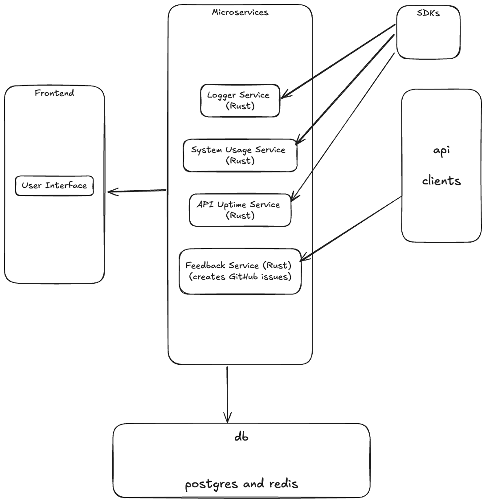

# Admin Nexus

> [!IMPORTANT]
> Under Development. Not ready for production use

Admin Nexus is a powerful and flexible admin dashboard designed to streamline the management of applications. Offering real-time insights, logging, feedback tracking, and more, it simplifies admin tasks while providing a user-friendly interface for monitoring application health, feedback, and data stats. This project is under active development and aims to provide an all-in-one solution for application management.

## Features

### Logging

Admin Nexus offers an intuitive logging system, allowing developers to send logs via SDKs or APIs. These logs are automatically stored on the server and can be accessed on demand through the Admin Nexus dashboard. This centralized logging solution helps you track and manage application logs more efficiently.

### Feedback and Bug Tracking

Managing user feedback and bug reports is easy with Admin Nexus. You can send feedback reports using our APIs or SDKs, and if a report contains a bug or feature request, our bot will automatically create corresponding GitHub issues. This ensures that all feedback is promptly tracked and addressed.

### Database Stats and Dashboards

Admin Nexus provides drag-and-drop dashboards for monitoring database metrics. You can track stats like user growth, activity levels, and posts per hour, offering actionable insights to help you make informed decisions. The dashboard makes it simple to visualize critical data points and monitor application performance.

## Getting Started

Follow the steps below to set up and start using Admin Nexus in your local environment.

### Prerequisites

- **Docker**: Ensure Docker is installed. Download it [here](https://www.docker.com/products/docker-desktop).
- **Git**: To clone and manage the repository.

### Installation

#### Using Git

1. Clone the Admin Nexus repository:

```bash
git clone https://github.com/himasnhu-at/adminNexus.git
```

2. Navigate to the project directory:

```bash
cd adminNexus
```

3. Start the application:

- **Using Rust**:

```bash
cargo run --release -- --port 4000  # default to 8080
```

- **Using Docker**:

```bash
docker build -t admin_nexus .
docker run -d -p 8080:8080 admin_nexus
```

#### Using Docker Compose

1. Create a `docker-compose.yml` file:

```yaml
services:
  adminNexus-backend:
    image: Himanshu806/admin_nexus:latest
    expose:
      - 8080:8080
    command: cargo run --release -- --port 8080

  adminNexus-frontend:
    image: Himanshu806/admin_nexus:latest
    expose:
      - 4000:4000
    command: |
      cd website
      pnpm start
```

2. Run the Docker Compose file:

```bash
docker compose up -d
```

> [!IMPORTANT]
> Ensure your `.env` file is properly configured with necessary API keys and environment variables before starting the server.

Once setup is complete, access the application at `http://localhost:4000`.

## SDKs and APIs

Admin Nexus provides SDKs and APIs to simplify integration with your applications. Here's a quick overview:

- **Logging API**: Send logs to our server for real-time tracking.
- **Feedback SDK**: Send feedback or bug reports directly from your application.
- **Database API**: Query real-time stats and monitor your app’s performance through our API.

> [!NOTE]
> The SDKs are under continuous development, ensuring seamless integration with various platforms.

## Contributing

We welcome contributions from the community! To contribute:

1. Fork the repository.
2. Make your changes.
3. Create a pull request to have your changes reviewed and merged.

> [!NOTE]
> Please follow our [Code of Conduct](CODE_OF_CONDUCT.md) and review the contribution guidelines before submitting any pull requests.

## Architecture

Admin Nexus is designed with a microservices-based architecture for scalability and optimal performance.



The architecture includes:

- **Frontend Service**: A React-based dashboard for managing admin features.
- **Backend API Service**: A Node.js/Express service that handles log storage, feedback management, and data queries.
- **Database Layer**: A robust database for log storage, analytics, and data retrieval.

## SDK Progress

The current development status of SDKs:

## SDK Progress

The development status of SDKs across different languages and frameworks:

| Language / Framework        | Started? | Version        | Remarks                       |
|-----------------------------|----------|----------------|-------------------------------|
| **Rust**                    | TBD      | TBD            | TBD                           |
| **TypeScript (Node/Nest)**  | TBD      | TBD            | TBD                           |
| **Python (Flask)**          | TBD      | TBD            | TBD                           |
| **Go**                      | TBD      | TBD            | TBD                           |
| **Flutter**                 | TBD      | TBD            | TBD                           |
| **Swift**                   | No       | TBD            | TBD                           |


> [!IMPORTANT]
> Admin Nexus is in active development. Stay updated with our [roadmap](ROADMAP.md) for feature releases and improvements.

## License

This project is licensed under the [BSD 3-Clause License](./LICENSE).

---

This README provides clear instructions, highlights key features, and shows the development progress of SDKs and APIs, making it easier for developers to get started with Admin Nexus.
